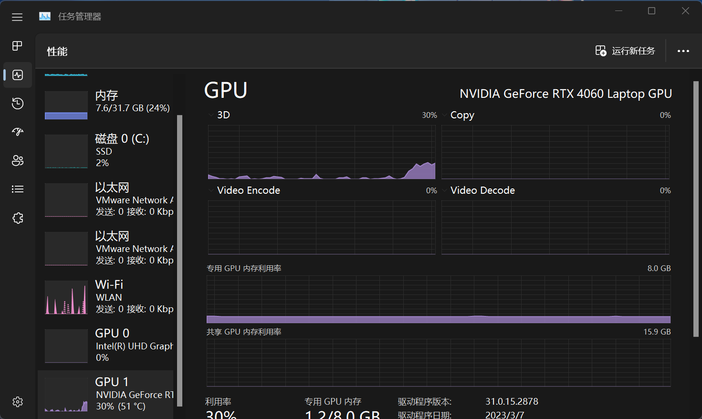
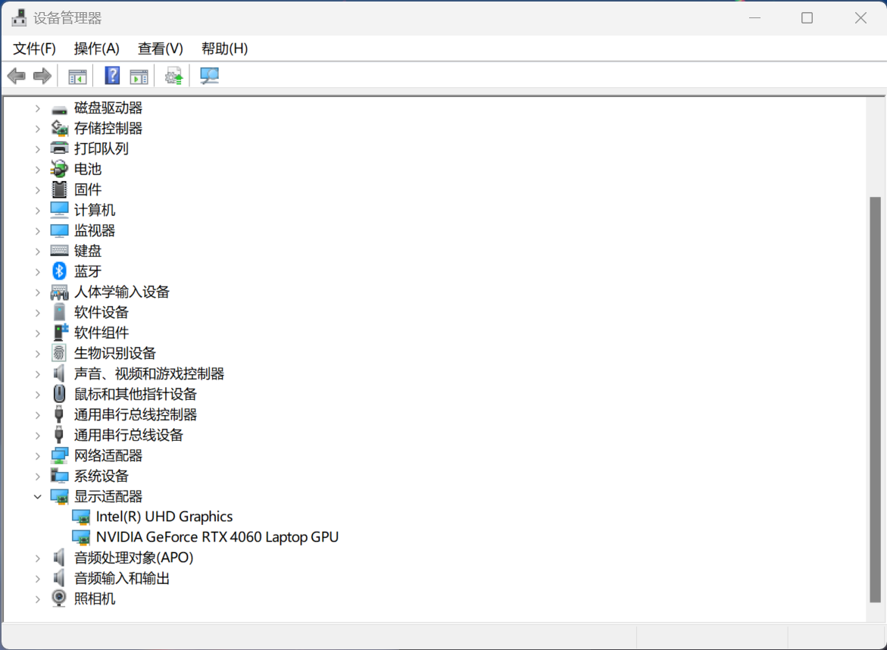

# 准备工作

进行图形开发，需要的准备工作是极多的，因为很多相关的配置需要进行，相关的知识需要学习

# 窗口系统


图形程序是显示在一个窗口里的，那么相应的，就有

* 负责管理窗口的程序（窗口管理器）

* 一些相关概念

> 不过需要注意的是，图形开发的很多东西**不是"跨窗口管理器"的**，使用不支持的东西是会导致运行时的*奇怪的问题*或者**直接崩溃**，这些都有在文档照中标注出

这是在平台之上再次细分出的概念，有的操作系统 ~~比如linux~~ 上有很多个窗口系统供给选择

**得益于winit，这些混乱的差异我们不需要管，我们可以用一个方法做一种事而不是为了每一种窗口系统编写不同的代码。最多只需要在使用功能时多注意目标的窗口系统支不支持这个功能就可以了就可以了。不过基本地，你得可以认得出你的窗口系统是什么**


[***下一节没必要阅读，点我快进到后一节***](#驱动问题)

## WSL下的奇怪问题

> 这里的WSL仅指WSL2

首先你得知道，linux的窗口系统是一个额外的软件，而不像windows那样是系统的一部分，你得安装它（这里只安装了*Xorg*，你可以自己装上*Wayland*）

Ubuntu
```bash
sudo apt install xorg
```
Archlinux
```bash
sudo pacman -S xorg 
```

然后因为wslg的存在，你应该可以直接运行linux下的gui程序

> wslg的原理也是很朴实无华：通过*rdp*/*vnc*(总之就是远程连接)转发窗口实现在windows下无缝运行linux程序。但是目前已知的问题不少，且个个致命（如果我找到好的解决方案我会立刻写上！）。也是因为这些问题，**不推荐使用**
> 
> 1. 对于*MouseMotion*事件（鼠标相对移动事件）获取到的数据不会是相对位置，而是一个绝对位置。比如说鼠标从(100,100)移动到了(100,110)，正常应该得到(0,10)，而*远程连接*下得到的却是(100,110)，这意味着全部*相机*之类的程序无法正常运行。
>
> 2. *锁定鼠标*的api不会生效，比如运行*Minecraft*那样的游戏就没法正常运行，因为你仍然可以把鼠标拖出窗口。~~而且因为第一条，视角会乱转而不是按照预期，非常致命~~

否则，你可以尝试这样的一些方案运行wsl下的linux gui程序

### VcXsrv

这是一个windwos下的*Xserver*

启动程序，选择*Start no client*（只启动一个*Xserver*），然后勾选*Disable access control*（使得linux的*Xclient*可以连接上*VcXsrv*）

> 如果你准备开一个DE，就不要选择*Multiple windows*模式，不然会很鬼畜。如果你不准备开DE，推荐选择*Multiple windows*
>
> 也有的的应用 *~~linuxqq~~* 在窗口模式下很诡异，无法调整窗口大小啊什么的

接着你需要设置环境变量，使得程序可以连接到*Xserver*。你可以这样做：

```bash
export DIAPLSY="$(cat /etc/resolv.conf | grep nameserver | awk '{print $2}'):0"
export WAYLAND_DIAPLSY="$DIAPLSY"
```

然后你应该就可以直接运行*linux gui*程序了

### Vnc

和上一个类似，但是原始许多，Vnc可以说是一个远程连接程序，就像平常一样启动vncserver，然后连接就可以了。不过即使是回环地址，效率也有点感人

# 驱动问题

很多时候，驱动问题会导致图形运行地非常缓慢或者无法运行。这个问题在Windows和Linux都相当常见，在wsl更加常见(但是谁会用wsl整图形开发呢？ ~~~我~~~ )

首先，你得确定你的设备有显卡，如果你的设备没有显卡请移步软渲染

## Windows

可以打开任务管理器`Ctrl + Shift + Esc`，切换到`性能`选项卡，你应该可以找到`GPU0` `GPU1`之类的


如果没有，大概率是有问题，你可以打开`设备管理器进一步确认`。打开`显示适配器`，你会看到这样的显示：

* 一个/多个 `Intel` `NVIDIA` `AMD` 开头的条目 总之不太可能是中文，如果是中文，大概率是有问题。如果图标右下角有黄色感叹后，也


关于Windows的驱动问题，已经有巨量的资料了。对于驱动的安装，大概总结一下就是遵循做法：

1. 如果是笔记本，看看厂家有没有提供驱动，如果有优先使用厂家提供的驱动程序

2. 在显卡官方那官网下载驱动 [intel](https://www.intel.cn/content/www/cn/zh/support/detect.html) [amd](https://www.amd.com/zh-hans/support) [nvidia](https://www.nvidia.cn/geforce/drivers/)，点击连接可以直接跳转

3. *最好不要使用什么驱动xx之类的软件，官网不能解决的问题它们就可以解决吗*

## Linux

Linux下的GPU驱动算是一个比较复杂的话题，我个人用的比较多的是[ArchLinux](https://archlinux.org)，所以以下经验基本是建立在ArchLinux上的

[ArchLinuxWiki](https://wiki.archlinux.org/title/Xorg#Driver_installation)说的很好，我就不扩充，总之就算是安装那些`xf86-video-`开头的软件包

但是， ~~有句古话说得好，**Nvidia, fuck you!**~~ 如果你是nvidia显卡，事情就变得有意思起来了！

nvidia显卡分为开源的闭源的，开源的是mesa实现的nouveau驱动
``` bash
sudo pacman -S xf86-video-nouveau
```
毕竟不是官方参与开发的，这个驱动只能说一般情况下ok，我也没碰见过问题。不过除此之外也有nvidia家的闭源驱动选择
> ***需要注意的是它会/需要禁用nouveau的加载，在archlinux这个过程自动完成***

> 以下内容可能只对archlinux适用

首先，你得知道你是什么内核

对于标准的`linux`内核，直接安装这个就可以，*archlinux不推荐通过官网提供的二进制程序安装驱动*
```bash
sudo pacman -S nvidia
```
对于`linux-lts`(长期支持版)内核，
```bash
sudo pacman -S nvidia-lts
```

其他内核就比较麻烦了，只能用*DKMS(Dynamic Kernel Module System)(动态内核模块系统)*解决

> 意味着每次变更内核/驱动，都会自动重新编译一次内核模块

```bash
sudo pacman -S nvidia-dkms
```

## mesa和wsl的爱恨情仇

mesa相当好，是一个开源的图形驱动，适用于大量GPU

实际上，这一节没必要存在，但是因为我*善于折腾*，接触了很多mesa相关的东西，便愈发觉得这一节的重要性

如果你用的是wsl，并且你希望享受到GPU加速而不是软渲染(***`l l v m p i p e / l a v a p i p e`***)的话，你就可以继续看了，不然你就跳过吧！

> 这里我只涉及`Ubuntu`和`Archlinux`作为wsl

### WSL-OpenGL

如果你是Ubuntu的wsl，你应该可以在安装`mesa`之后直接享受到OpenGL
```bash
sudo apt install mesa-utils
```
然后可以使用这个指令
```bash
glxinfo -B | grep Device
```
如果你看到类似`Device: D3D12 (Intel(R) UHD Graphics) (0xffffffff)`这样（D3D12开头）的说明你已经可以享受到opengl加速了


但是如果你是Archlinux

> 我使用的是ArchWSL，如果是你自己搞的，可能会缺失很多关键东西，使得这一切完全无法进行

安装
```bash
sudo pacman -S mesa-utils
```
然后
```bash
glxinfo -B | grep Device
```
你会看到`Device: llvmpipe (LLVM 16.0.6, 256 bits) (0xffffffff)`：认识一下，llvmpipe也就是软渲染，也就是CPU模拟GPU进行渲染，一般是作为最后选择/服务器渲染，总之很不合适！

没有使唤上真正GPU的原因是什么呢？是因为你缺了一点点东西！运行这个命令
```bash
ldd /usr/lib/wsl/drivers/*/*.so | grep "not found"
```
你会发现下面类似下面那样的输出
```
        libedit.so.2 => not found
        libigdgmm_w.so.12 => not found
        libedit.so.2 => not found
        libedit.so.2 => not found
```

`not found`意味着某的驱动它所需的某个动态库缺失了，你需要手动补全它缺失的依赖来让它运作，略微有点麻烦

> *libigdgmm_w.so.12 这个不用解决也解决不了*

基本上在pacman都可以找齐，除了`libedit.so.2`。其实解决方法也是很朴实无华，手动链接一下就可以（注意你的可能不是libedit.so.0.0.72，而是别的版本，你直接链接就是了）
```bash
sudo ln -s /usr/lib/libedit.so.0.0.72 /usr/lib/libedit.so.2
```

如果无误，你现在就可以享受到opengl加速了。这是mesa的一部分：D3D12，可以说专为wsl开发，功能就是将OpenGL调用转译为D3D12(这里的意思是[`DirectX3D12`](#directx))

如果你嫌弃默认选择的是核显比较慢，你可以通过`MESA_D3D12_DEFAULT_ADAPTER_NAME`环境变量设置为独显，比如用这个就可以选择nvidia显卡
```bash
export MESA_D3D12_DEFAULT_ADAPTER_NAME="nvidia"
```
如果你的显卡和U是同一个厂的，你可以这样，它(应该)会选择RX7900
```bash
export MESA_D3D12_DEFAULT_ADAPTER_NAME="rx7900"
```

### WSL-Vulkan

单纯OpenGL其实挺够的，但不一定够，***如果你在WSL下开发Bevy，OpenGl做图形后端很大可能跑不起来！***

首先还是安装vulkan

Ubuntu
```bash
sudo apt install vulkan-tools
```

Archlinux
```
sudo pacman -S vulkan-tools
```

就像使用`glxinfo -B`一样，也有一个命令可以检测Vulkan API`vulkan`。我们使用grep过滤出有用的信息

```bash
vulkaninfo | grep "GPU id"
```

如果你是Ubuntu，可能会看到这个输出，显然，这是软渲染
```
                GPU id = 0 (llvmpipe (LLVM 15.0.7, 256 bits))
                GPU id = 0 (llvmpipe (LLVM 15.0.7, 256 bits))
                GPU id = 0 (llvmpipe (LLVM 15.0.7, 256 bits))
GPU id : 0 (llvmpipe (LLVM 15.0.7, 256 bits)):
GPU id : 0 (llvmpipe (LLVM 15.0.7, 256 bits)):
```
如果你是Archlinux，你可能会收到类似这样的报错，因为pacman不会在安装mesa时安装vulkan的软渲染
```
ERROR: [Loader Message] Code 0 : vkCreateInstance: Found no drivers!
Cannot create Vulkan instance.
This problem is often caused by a faulty installation of the Vulkan driver or attempting to use a GPU that does not support Vulkan.
ERROR at /usr/src/debug/vulkan-tools/Vulkan-Tools-1.3.263/vulkaninfo/vulkaninfo.h:688:vkCreateInstance failed with ERROR_INCOMPATIBLE_DRIVER
```

就像是D3D12，它提供了OpenGL一样，一样有Dozen，它提供了Vulkan


Dozen默认在mesa是禁用的，你得从源代码构建，或者下载它。对于Ubuntu，你可以通过ppa直接拿到已经编译好了，启用了Dozen的现成版本


> Dozen的资料太太太少了，mesa官网甚至都没记载它，仅仅在更新日志提名过。如果你没有代理的话这个下载也是很慢

```bash
sudo add-apt-repository ppa:kisak/kisak-mesa
sudo apt update
sudo apt upgrade
```

所以如果你不想通过这个下载，你或许可以试试我已经下载好的库：**极其不推荐这种行为，兼容性问题难以预料**

> 你可以在本书仓库的`src\projects\triangle\附件`找到`libvulkan_dzn.so`

移动到任何你喜欢的位置，然后创建一个文件，我这里使用在`/usr/share/vulkan/icd.d/`创建`dzn.json`

~~vim怎么用不用教吧~~

```bash
vim /usr/share/vulkan/icd.d/dzn.json
```

添入以下内容，`library_path`改为你放库文件的位置
```json
{
    "ICD": {
        "api_version": "1.1.246",
        "library_path": "/usr/lib/libvulkan_dzn.so"
    },
    "file_format_version": "1.0.0"
}
```

然后设置环境变量`VK_ICD_FILENAMES`为刚刚创建的文件的位置，比如`/usr/share/vulkan/icd.d/dzn.json`

此时再`vulkaninfo | grep "GPU id"`，信息就出现了真显卡
```
WARNING: dzn is not a conformant Vulkan implementation, testing use only.
WARNING: dzn is not a conformant Vulkan implementation, testing use only.
                GPU id = 0 (Microsoft Direct3D12 (NVIDIA GeForce RTX 4060 Laptop GPU))
                GPU id = 1 (Microsoft Direct3D12 (Intel(R) UHD Graphics))
                GPU id = 0 (Microsoft Direct3D12 (NVIDIA GeForce RTX 4060 Laptop GPU))
                GPU id = 1 (Microsoft Direct3D12 (Intel(R) UHD Graphics))
                GPU id = 0 (Microsoft Direct3D12 (NVIDIA GeForce RTX 4060 Laptop GPU))
                GPU id = 1 (Microsoft Direct3D12 (Intel(R) UHD Graphics))
GPU id : 0 (Microsoft Direct3D12 (NVIDIA GeForce RTX 4060 Laptop GPU)):
GPU id : 1 (Microsoft Direct3D12 (Intel(R) UHD Graphics)):
GPU id : 0 (Microsoft Direct3D12 (NVIDIA GeForce RTX 4060 Laptop GPU)):
GPU id : 1 (Microsoft Direct3D12 (Intel(R) UHD Graphics)):
```

# 图形API

你可能听说过`显卡(又叫Graphics Process Unit,GPU)`的概念，并且知晓显卡是用来渲染图形的，也就是负责绘制画面。

实际上，显卡就是一个构造比较特别的处理器，如果说CPU的计算能力是一个带学生团队，显卡的计算能力就是几百号小学生

显卡的设计是告诉进行大量计算，如果你看过多线程相关的知识，显卡就是有大量的物理线程，可以同时执行成千上万的运算

但是显卡在某些方面，比如内存延迟，分支预测等不优秀，而且不是每个运算单元都有自己的指令流水线，GPU内部的每一组运算单元只能运行一个程序

基本上，GPU是作为CPU的计算工具，辅佐CPU的计算工作罢了，GPU的运算任务也都是来自CPU的安排

就像CPU运行程序一样，GPU也是运行程序的，*所以你需要为GPU编写适用于GPU的程序*。用户是通过驱动来使用GPU，而现存GPU千千万，为了有通用的方法使唤GPU，就有了**图形API**

通过使用图形API，就可以通过驱动在不同的GPU上做一样的事，而不是为了每个GPU写一个代码

可以预料的，图形API是有很多个的，这里我会简单介绍一些

> 这里说到的*跨平台*起码包括Windows，Linux，MacOS，Android，IOS 这些平台

## OpenGL

> 全称*OpenGraphicsLibrary*。不要被名字误解：它不是开源的，它只是一个规范，意思是让写驱动的设计出这样的API供给开发者使用

元老级，是一个*跨平台*的图形API，用起来很*方便(存疑)*，并且简单易学。但是它受制于时代，设计有很大问题(有时用起来也有奇奇怪怪问题)

它并不能很好地压榨GPU性能，不够底层，相对来说可以做的事也比较少。很符合它的名字，他只是一个*图形库*，所以不可以用来进行*通用计算*

**它本尊于2017年停止更新**，但是它本身和它的分身(GLES,WebGL)仍在桌面，Web端和移动端等诸多领域活跃

~~它的分身也不会继续更新了！~~

不管怎么说，OpenGL还是图形开发的*首选*，对于Rust，它的绑定有底层的[glow](https://crates.io/crates/glow)和高级的[glium](https://crates.io/crates/winapi)。

## Vulkan

它是OpenGL的替代者

> 这并不是口号，它是OpenGL原班人马开发的，**OpenGL停止开发也是为了它**

Vulkan也是一*跨平台*的图形API，代表着*新一代图形API*(比如DX12,Matel)。被认为有着很高的学习成本，很多人都权衡这个性能提升值不值得？我觉得相比于OpenGL它所需要额外学习的东西是一个开发者所必须学习的，它带来的性能提升也是它暴露底层的必然

Vulkan不再是OpenGL那样的*状态机*设计，而是相对先进得多的*面向对象*，使得它天生亲近多线程。它暴露了底层的细节，拆分和定义了各种结构，把工作交给程序员，再好的程序员手中一切都会井井有条 

虽然开发上多了一些麻烦，但是这说明你可以根据自己的想法控制一切，知晓背后的细节，而不会被奇奇怪怪的问题烦恼，这一点*很重要*

Vulkan的*计算管线*更使得*通用计算*成为可能，使得GPU可以从*图形处理单元*变成*纯粹的计算机器*

Vulkan原生支持C++和C，对于Rust有着[ash](https://crates.io/crates/ash)这样的优秀底层绑定，和[vulkano](https://crates.io/crates/vulkano)这样的上层绑定

## DirectX

> 很抱歉我对这个了解不多，我也没直接用过这个API

这是微软为Windows，Xbox等开发的一个图形API，它*只支持微软的平台*！

> 貌似它比一个图形API大很多？

我个人认为它对标的是OpenGL，一般它在Windows也有很好的性能。而*DX12*做出了很多改变，成为就像Vulkan一样的*新一代图形API*，一样暴露了底层的细节交给程序员

~~为什么有的游戏DX12性能相比于DX11相当拉跨？本质不是别的，就是程序员拉跨！~~

它的Rust绑定就是[winapi](https://crates.io/crates/winapi)的一部分

## WebGPU

***主角登场！***

> 在[WASM](https://developer.mozilla.org/zh-CN/docs/WebAssembly)之后，可以预料的是，对于Web平台也会有一个高性能地操作GPU的API来取代WebGL

WebGPU也是*新一代图形API*，只不过它是面向*Web平台*(浏览器)的，它使得Web开发者也可以高效地享受到主机的CPU资源。毕竟WebGL就是OpenGL分身之一，不能满足人们日益增长的性能需要

WebGPU使得Web上的通用计算和高性能渲染成为可能，它的性能几乎就是使用原生API，~~使得浏览器挖矿成为可能，借每张路过的GPU一用~~ 因为它运行的原理就是让各个浏览器开发商提供WebGPU调用到实际图形API的转译。WebGPU里的GPU资源什么的，也是实际的GPU的资源，没有半分虚假

那么如果，我是说如果，把API转移这一部分从浏览器分离出来，不就可以用WebGPU这个图形API开发支持多种图形API的程序吗？

WGPU就是干这个的，它使得开发者可以使用WebGPU API开发*跨平台*，*跨API*程序，这个*跨平台*还额外跨了Web平台！

一个WGPU程序，它可能用的是[*Vulkan*](#vulkan)，可能是[*DirectX*](#directx)，也可能是[*OpenGL*](#opengl)。这样你的程序就不会因为不支持某种特定的API而无法运行，~~而是因为不支持所有API而无法运行，~~ 你可以选择合适的*适配器*来使用不同API，或者自动选择，对于不同API你可以只写一次代码

有趣的是，对于Web目标，它同时支持WebGPU和WebGL API，使得在WebGPU普及之前就可以有基于WGPU的应用。它对于其他API的支持也是如此目的，它从来都不不是一个单纯的*WebGPU绑定*，不要被它的名字迷惑，并且很多意义上它已然是Rust最好的图形API！

***接下来的教程使用的就是这个API***

> 现代api的设计理念基本是通用的，如果你掌握了Vulkan你可以很方便地转移到WGPU，或者别的，反之亦然，所以不要为此焦虑。其实学习编程语言也是这样的：殊途同归。
