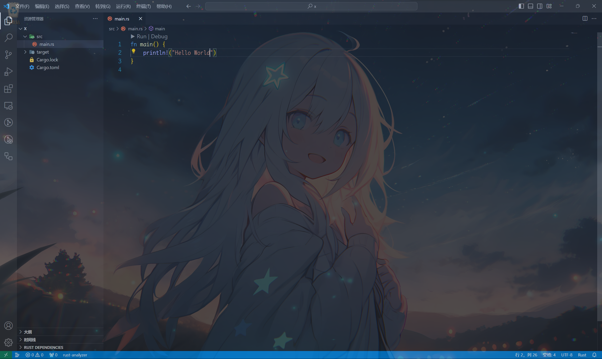

# 编程概念和基本语法

这一节开始就要正式进入编程的世界了！

在本节，你将完成一个最基本的rust程序

*本文中提到的所有有快捷键都是vsc的快捷键*

# 项目

什么是项目？

我的理解是，一系列组成这个程序的东西构成的一个整体。操作，配置和使用一整个项目相比于使用一大堆文件来说，是极其简单的

rust程序员很有使用项目的习惯。其他语言的初学者都是从单文件再到项目，但是rust程序员对项目的使用是“从小培养的”

*在rust项目被称为crate*

## 创建项目

创建项目有两种方案，建议windows使用cargo init，因为windwos使用终端不是很方便

*只有在编辑器打开项目文件夹，才可以享受来自`rust-analyzer`的强大支持*

*`rust-analyzer`：rust的lsp(语言服务器协议)实现，作用是让编辑器能够补全，重构rust代码，并且提供大量可以辅助编写rust代码的功能。它可以极大简便rust代码的编写*

1. cargo init：在一个文件夹下的终端内运行`cargo init`，这个文件夹就是项目文件夹

2. cargo new: 在一个文件夹下的终端内运行`cargo new <项目的名字>`，将会创建一个和项目同名的文件夹，那个文件夹才是真正的项目文件夹

你可以这样做：

1. 在一个你喜欢的位置创建一个空文件夹

2. 使用编辑器打开这个空文件夹

3. 打开编辑器的终端，输入`cargo init`，然后回车运行

你可以按下以下快捷键来进行操作：

* `ctrl + k` 然后 `ctrl + o` 打开文件夹

* `ctrl + shfit + ` `打开终端

然后点击界面左上角的文件图标，或者`ctrl + shift + e`打开`文件资源管理器`

## 项目结构

你可以看到有一个叫`src`文件夹，和一个叫`Cargo.toml`的文件 

* `src`文件夹是存放源代码的文件夹

* `Cargo.toml`文件是负责描述项目的文件，其具体作用后面才会介绍

打开`src`文件夹，你可以看到一个叫`main.rs`的文件，单击以打开它

*`rs`是rust源代码文件的后缀名*

此时你的界面大概是这样的

如果你的编辑器正常运作，你会看到

* 左边多出了`Cargo.lock`文件和`target`文件夹

* `fn main`上面会有`Run | Debug`的字样

*第一次加载可能会略微有些慢，请耐心等待，基本不会出问题。*

*但是如果你是Windwos并且加载极其缓慢，你可能可以查阅[这里](./install.md#windows下的奇怪问题)来解决问题 ~~血的教训~~* 

