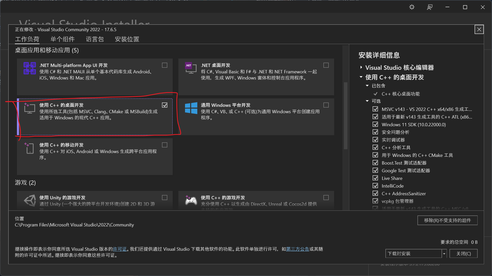
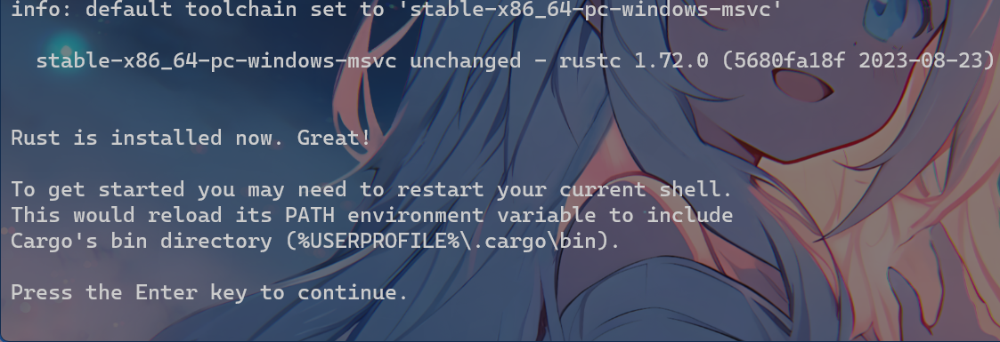
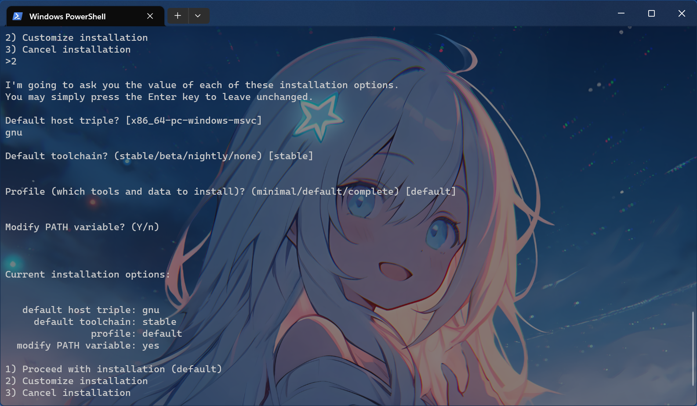

# 安装Rust

学了一堆概念，是不是头晕眼花呢？我写概念时也是这样的状态

# 编程语言 Rust

前面说到过，CPU只能执行最简单的机器指令，但是让人类来写机器指令是很痛苦的，于是出现了编程语言

这样，只需要写一些人类*很容易*看懂的东西，就可以从**编译器**获得CPU可以执行的指令，你可以理解为是一种翻译

解决问题的方法有很多，所以有很多编程语言，它们的设计理念有所差异，它们各有各的特色和优缺点

*比较一门语言的好坏要结合多方面的实际，而不是片面地使用自己的主观感受来评价*

*你觉得一语言好不好，可能是你不喜欢语言的设计理念，或者对语言某方面的内涵感到困惑*

*我的教程可能并能很优秀地展示出Rust的内涵，如果有不懂的地方欢迎指出，也欢迎加入QQ群(1064891174)讨论*

*罗卜白菜各有所爱，你不喜欢有的是人喜欢。要文明和谐*

本教程教的是[Rust](https://www.rust-lang.org/zh-CN/)：一门赋予每个人
构建可靠且高效软件能力的语言

~~以下部分看不懂就跳过~~

Rust是一门*开源*的语言，意味着这个语言实际上是无数人和组织共同创造和维护的，如果你将来学有所成，你也可以参与开发Rust，为它做出贡献

Rust是一门跨平台语言，意味着如果你使用它编写代码，你的程序可以在很多平台和硬件上运行，包括手机，平板，电脑，嵌入式设备......

Rust是一门新的编程语言，Rust1.0与2015发布，Rust是一门相当年轻的语言，也得益于*开源*，使用它可以接触到很多先进特性

不同于C/C++，Rust*目前*使用的是统一的编译器，统一的强大的cargo，没有奇奇怪怪的*编译器特性*，基本不用为了各种依赖奔波

Rust语法比较严格，很多东西不被允许，但是这不是坏处：不被允许是有原因的

Rust不是一门*面向对象*，的语言，但是它具有很多面向对象的特性，也具有很多其他编程范式的特征

Rust和C/C++一样是一门编译型语言，代码需要编译才可以运行，运行速度极快

Rust和C/C++一样是一门底层语言，可以被用来写底层软件，比如操作系统

# 安装

从下一节开始，就要开始学习编写代码了

为了编写代码，我们首先需要一个**工具链**

工具链是将代码变成机器指令所需要的一系列工具，CPU并不能理解你写的代码，操作系统亦不会直接把你写的东西直接喂给CPU

不同操作系统安装方法不尽相同：

| 平台 |  |
| --- | --- |
  [Windows](#windows) | 如果你没操作系统方面的概念，如果你使用的是电脑，你大概用的就是Windows |
| [Linux](#linux) | 可能Linux用的人比较少，但是这是最适合编程的操作系统 |
| Mac | 不清楚，我没Mac |
| [安卓手机/平板](#termux) | 真不建议使用这个学编程，很不方便（但是也不是不行）|
| 苹果手机/平板 | 更不建议使用这个学编程，超级不方便，虽然M系列性能很强 |

安装完成后之后你需要看[*编辑器*](#编辑器)来配置编写代码的工具，也可以看[*优化*](#优化)

*感谢字节跳动的[rsproxy.cn](https://rsproxy.cn)*，它使得在国内开发rust很方便

## Windows

Windwos下有两个工具链：msvc和gnu

它们之间的区别，不大

* gnu工具链不需要下载太多东西，但是编译得到的程序体积略微大一点

* msvc工具链编译得到的程序体积较小，但是需要安装msvc生成工具才可以安装

### 1. msvc生成工具

*如果你以前有安装VS的C++工具链，可以直接跳过这一步*

*如果你不选择安装msvc工具链，你可以跳过这一步*

1. 安装[*宇宙第一ide*](https://visualstudio.microsoft.com/zh-hans/thank-you-downloading-visual-studio/?sku=Community&channel=Release&version=VS2022&source=VSLandingPage&cid=2030&passive=false)（点击链接就可以下载）

2. 运行程序，稍等片刻VS的下载器就会安装好

3. 在安装器勾选*使用C++的桌面开发*然后安装


### 2. rustup


*你不可以跳过这一步*

~~*忽略我的壁纸*~~

1. 点击[链接](https://static.rust-lang.org/rustup/dist/x86_64-pc-windows-msvc/rustup-init.exe)下载*rustup-init.exe*

2. 打开*powershell*（你可以win+r，然后输入powersehll，然后回车），输入以下两条命令，回车。这一步的目的是加快下载速度，否则因为国内的网络环境很容易下载失败
``` powershell
$env:RUSTUP_DIST_SERVER="https://rsproxy.cn"
$env:RUSTUP_UPDATE_ROOT="https://rsproxy.cn/rustup"
```

3. 将你刚刚下载的*rustup-init.exe*拖拽进*powershell*，回车，你应该看见这样的输出


4. 如果你要安装msvc工具链，输入1，然后回车，耐心等待下载，你会看到大概这样的输出，然后你可以关闭终端了

4. 如果你要安装gnu工具链，输入2，然后回车，输入gnu，然后回车四次然后输入1，回车，等待下载，你会看到和上一条类似的输出

## Linux

*既然用上linux，就假定你对linux有基本的了解*

这里有两个方案：

* 使用官方的下载方式(推荐)

* 使用包管理器下载rustup(你的包管理器可能没有这个包，不过起码在arch有)

### 1. 打开终端，设置镜像

否则因为国内的网络环境很容易下载失败，你可以把这个设置进`.bashrc`，`.zshrc`之类的配置文件

```bash
export RUSTUP_DIST_SERVER="https://rsproxy.cn"
export RUSTUP_UPDATE_ROOT="https://rsproxy.cn/rustup"
```

### 2. 安装rustup

如果你用的Archlinux，你可以这样做。这样rustup的更新，卸载等都通过pacman管理

``` bash
sudo pacman -S rustup; rustup
```

或者通用方案
```bash
curl --proto '=https' --tlsv1.2 -sSf https://rsproxy.cn/rustup-init.sh | sh
```

输入1，回车，等待下载即可

*如果你使用的shell是fish，你需要手动在配置文件里把`~/.cargo/bin`加进path，rustup不会自动设置fish的环境变量*


## Termux

*既然用上termux，就假定你对linux有基本的了解*

termux的安装和注意事项和linux相同，你直接看[上一部分](#linux)就可以了

# 编辑器

这一步的前提是，你已经安装好了rust工具链，详细见[安装](#安装)

编辑器是用来编写代码的工具，它可以在编写代码上提供相当多的帮助，甚至有人离开了代码编辑器写不出代码

但是也不要排斥使用编辑器，科技发展不就是为了提供便利吗

现在的编辑器不仅仅可以编写代码，也可以一键*运行*代码，进行*调试*，*重构*等等

配置好这个工具是相当重要的，我也会在后面介绍相当多使用编辑器方便编码的技巧

## Visual Studio Code

目前很适合用来编写rust的编辑器有以下几个：

* JetBrains的 [Pycharm](https://www.jetbrains.com/pycharm/download/?section=windows)和[IDEA](https://www.jetbrains.com/zh-cn/idea/)

* Microsoft(微软)的[Visual Studio Code](https://code.visualstudio.com/)和它的*开源*版本[Code-OSS](https://github.com/microsoft/vscode)

* 任何编辑器，只要你会用

我这里着重介绍Visual Studio Code，因为我也是使用的这个编辑器

###  安装

| 平台 | 方式 | 
| --- | --- |
| Windows，或者Drawin | 进入[官网](https://code.visualstudio.com/)，点击`Download for Windows`(反正就是那个蓝色按钮)，然后安装即可
| Debian或者Redhat系的linux | 同上在官网直接下载，这个系列的linux可以直接安装到微软的版本| 
| Archlinux | 虽然这个和其他linux一样只有code-oss(code-oss也完全够用)可以选择，但是archlinux可以从aur下载到[visual-studio-code-bin](https://aur.archlinux.org/packages/visual-studio-code-bin) 
| 其他linux | 看看包管理器能不能下载到code ~~不然你可试试从源码构建~~ |
| 安卓设备 | 可以试试使用[code-server](https://github.com/coder/code-server)(需要有外接键盘，不然体验极差)，或者vim/nvim

##  插件

默认的Visual Stuido Code功能十分贫乏，需要做一些配置 ~~调教~~ 。Visual Stuido Code(接下来就简称vsc了)的一大特色就是：插件。通过安装插件，可以赋予vsc许多原来没有的功能

在vscode的侧栏选择`插件`(或者`Ctrl + Shift + X`)就可以搜索&安装插件了。你可以点进我下面提供的链接进行跳转下载

为了舒服地使用vsc开发rust，需要安装下面的部分插件。可选插件不是必须的，但是可以切实提升使用体验

### （可选）[Chinese (Simplified) (简体中文) Language Pack for Visual Studio Code](https://marketplace.visualstudio.com/items?itemName=MS-CEINTL.vscode-language-pack-zh-hans)

汉化界面的插件

搜索时直接搜索Chinese就可以了，这个插件一般会自动安装


### [rust-analyzer]

这是最重要的插件，开发rust全靠这个。它可以给出提示，提供代码补全，重构代码，查找声明和使用，一键编译运行......总之就是极为强大

### （可选）[Even Better TOML](https://marketplace.visualstudio.com/items?itemName=serayuzgur.crates)

上一个插件是为rust源代码服务，而这个是为了toml文件服务，具体知识后面还会介绍：它很有用就是了

### （可选）[crates](https://marketplace.visualstudio.com/items?itemName=serayuzgur.crates)

这个插件的作用是显示你在Cargo.toml内添加的依赖的版本是否正确，以及帮你补全版本。具体知识后面还会介绍

### 调试插件

调试可以让你知道代码运行时的状态，你可以从中分析到代码出错的地方然后修复错误

调试插件有两个选择，使用大同小异

* [CodeLLDB](https://marketplace.visualstudio.com/items?itemName=vadimcn.vscode-lldb) Linux推荐使用这个（仅仅推荐，我Windows也是用的这个）

* [C/C++](https://marketplace.visualstudio.com/items?itemName=ms-vscode.cpptools) Windows推荐这个，linux最好别用这个（真的不要用）

### （可选）[Error Lens](https://marketplace.visualstudio.com/items?itemName=usernamehw.errorlens)

它的作用是将代码中的警告和错误显示到出现问题的代码后，更加直观。仅仅起到观感上的作用。有的人不喜欢这个，觉得会让人分心

# 优化

***这里的内容比较复杂且不是必须的，只是提前写出来，如果你看不懂请跳过***

如果用的是rustup，rust默认会被安装在用户文件夹下的`.cargo`和`.rustup`文件夹。在`.cargo`文件夹下创建一个`config.toml`文件然后修改它的内容，可以对cargo进行一些配置

本文接下来的就是介绍这个配置文件

*你也可以在一个项目下创建`.cargo/config.toml`，优先级更高*

## 换源

crates.io一般是从github获取库/项目，一般在国内有着严重的网络问题。这也是为什么一群人被拦在官方教程第二章的rand上

*解决方案就是使用镜像*

意思是从rsproxy.cn而不是从crates.io获取crates.io上的内容

在config.toml加入以下内容
```toml
[source.crates-io]
replace-with = 'rsproxy-sparse'
[source.rsproxy]
registry = "https://rsproxy.cn/crates.io-index"
[source.rsproxy-sparse]
registry = "sparse+https://rsproxy.cn/index/"
[registries.rsproxy]
index = "https://rsproxy.cn/crates.io-index"
[net]
git-fetch-with-cli = true
```

然而，rustup也要换源

* RUSTUP_DIST_SERVER 设置为 https://rsproxy.cn
* RUSTUP_UPDATE_ROOT 设置为 https://rsproxy.cn/rustup

如果是windows，请使用`编辑系统环境变量`，这个可以通过`搜索`得到

如果是bash/zsh，可以在`.bashrs` 或者 `.zshrc` 输入以下
```bash
export RUSTUP_DIST_SERVER="https://rsproxy.cn"
export RUSTUP_UPDATE_ROOT="https://rsproxy.cn/rustup"
```

如果是fish，在fish配置文件加入
```fish
set -x RUSTUP_DIST_SERVER "https://rsproxy.cn"
set -x RUSTUP_UPDATE_ROOT "https://rsproxy.cn/rustup"
```

## 链接器

rust编译器完成了源码到程序的绝大多数工作：除了链接

比如*gnu*和*msvc*工具链使用的就是不同的链接器。*当然，工具链之间的区别不止这一点*

使用一个更快的链接器，可以很好地提升rust的编译速度。这是一个高度取决于平台的设置

### lld

*llvm linker*

它比各平台默认的链接器要快，而且快**很多**

*而且有些 ~~msvc~~ 平台默认的链接器无法编译某些 ~~bevy~~ 大型rust程序*

它有一个rust包装叫`rust-lld`，可以很方便地使用

使用以下命令安装：
```shell
cargo install -f cargo-binutils
rustup component add llvm-tools-preview
```

然后在`config.toml`加入
```toml
[target.x86_64-pc-windows-msvc]
linker = "rust-lld.exe"
```

如果你是gnu工具链，替换`x86_64-pc-windows-msvc`为`x86_64-pc-windows-gnu`，总之替换成你使用的target就是了

如果你是linux，应该是这样的
```toml
[target.x86_64-unknow-linux-gnu]
linker = "rust-lld"
```

但是linux下可以使用更好的链接器：mold

### mold

*A Modern Linker*

它是一个多线程的链接器，**比*lld*还要快很多**，超级快，几乎就是复制文件一样的速度

***没有windows/mac版本，windows或者mac使用lld吧***

它的安装需要使用包管理器，并且依赖于clang

*如果你直接使用lld而不是rust-lld，也需要一个clang或者别的编译器作为传递*

Arch：`sudo pacman -S clang mold`

Ubuntu：`sudo apt-get install clang mold`

然后在`config.toml`加入
```toml
[target.x86_64-unknown-linux-gnu]
linker = "clang"
rustflags = ["-C", "link-arg=-fuse-ld=/usr/bin/mold"]
```

`/usr/bin/mold`应换成mold实际路径，不过默认都是在这个路径